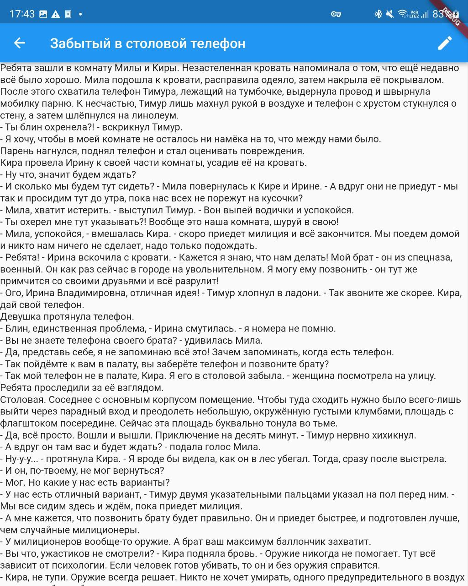

# bibisco_editor

A Work In Progress project to edit Bibisco files on a mobile platform.

Currently tested for Android 12 phone (Samsung zFold3)

Right now is able to edit and save Scene revisions.

# Screenshots

