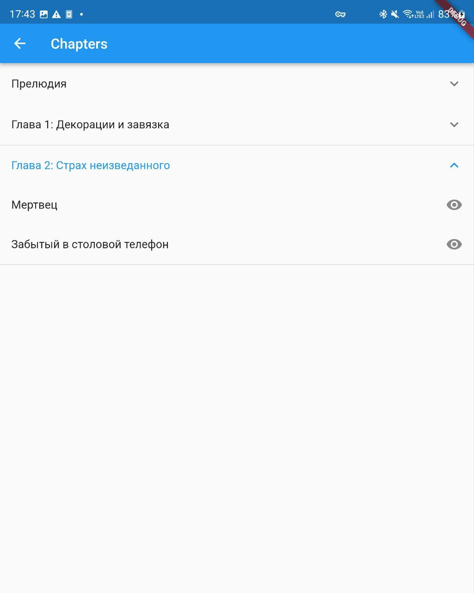

# bibisco_editor

A Work In Progress project to edit Bibisco files on a mobile platform.

Currently tested for Android 12 phone (Samsung zFold3)

Functionality so far:
- Edit and Save Scene revisions
- Create new scene (unassigned to a chapter, not visible at Bibisco App)
- Draft localization: EN

# Screenshots

